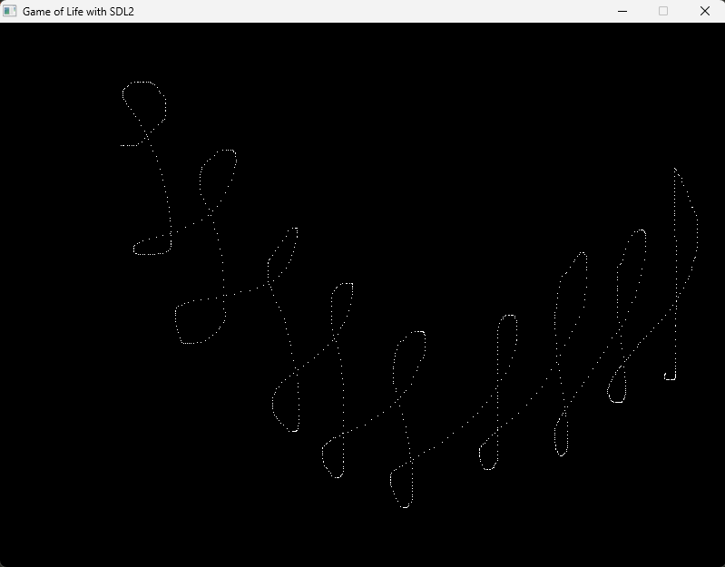
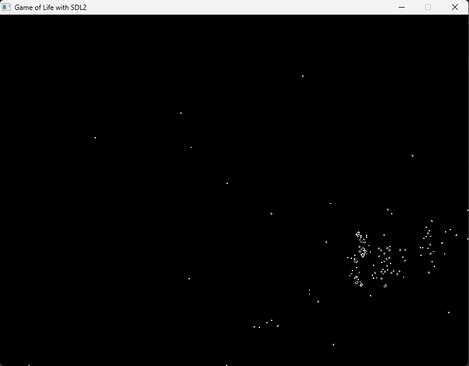

## Game of Life with SDL2

This is a simulation of John Conway's Game of Life. Initially, you can set the initial state (each pixel is a cell) by clicking AND moving your mouse. Then at any point you can type the A key and the simulation will begin.

## Screenshots

  
  

## Technologies Used

- C/C++
- Makefiles
- SDL2

## How to Use

- Clone this repo anywhere you want
- Open the command prompt in that directory 
- Then type <code>make run</code> and hit Enter, the project should be running.
